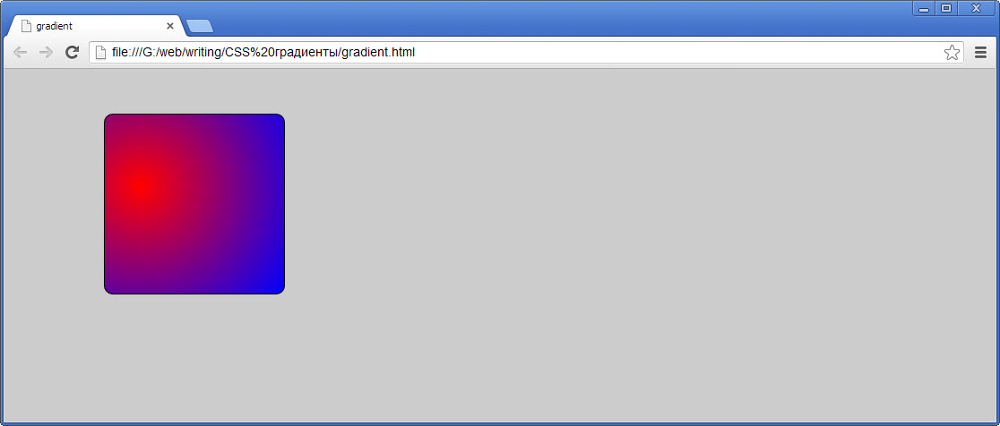

# CSS градиенты

Градиент - это плавный переход одного цвета в другой. До появления спецификации CSS3 веб-разработчики при верстке страниц для передачи градиента так, как это было задумано веб-дизайнером, использовали графические картинки, которые вырезали из psd-макета. С помощью CSS3 этот неуклюжий и громоздкий прием можно забыть и переложить задачу создания градиентов на "плечи" браузеров, которые делают это чисто программным способом.

Преимуществ программного способа передачи градиента очень много. Это и легковесность решения, и гибкость при создании или редактировании градиента, разнообразие способов создания градиента. Минусы конечно есть - это достаточная сложность создания градиента и поддержка браузерами с помощью вендорных префиксов на сегодняшний день.

Одно интересная и важная деталь - градиентная заливка (градиент) с точки зрения браузера является фоновой картинкой, фоновым изображением. Поэтому к градиенту применимы все свойства, доступные для фонового изображения: `background-origin`, `background-position`, `background-clip`, `background-attachment`, `background-size`, `background-repeat`.

Градиенты бывают **линейными** и **радиальными**. **Линейный градиент** - это плавное изменение цвета от одного к другому линейно, **по прямой** (*или вектору - кому как нравиться понимать*). Линия (*или вектор*) могут располагаться как угодно: горизонтально (слева направо или справа налево), вертикально (сверху вниз или снизу вверх), под любым углом (из левого нижнего угла к правому верхнему, к примеру). **Радиальный градиент** - это плавное изменение цвета от одного к другому **по радиусу**, от центра круга к окружности. Начальная точка радиуса (центр градиента) может перемещаться по-горизонтали с помощью свойства `background-position`. Длина радиуса градиента может изменяться с помощью ключевых слов: `closest-side`, `closest-corner`, `fathest-side`, `fathest-corner`.

В дальнейших примерах код для создания градиентов приводится уже с браузерными префиксами.

## Линейные градиенты

Самый простой случай создания линейного градиента:

... и CSS-код, который создает такие примеры:

<pre>
.foo{
  background-image:                 -webkit-linear-gradient(left,#000,#fff);
  background-image:   -moz-background-image-linear-gradient(left,#000,#fff);
  background-image:     -o-background-image-linear-gradient(left,#000,#fff);
  background-image:                         linear-gradient(left,#000,#fff);
}

.moo{
  background-image:                 -webkit-linear-gradient(top,#000,#fff);
  background-image:   -moz-background-image-linear-gradient(top,#000,#fff);
  background-image:     -o-background-image-linear-gradient(top,#000,#fff);
  background-image:                         linear-gradient(top,#000,#fff);
}

.poo{
  background-image:                 -webkit-linear-gradient(right,#000,#fff);
  background-image:   -moz-background-image-linear-gradient(right,#000,#fff);
  background-image:     -o-background-image-linear-gradient(right,#000,#fff);
  background-image:                         linear-gradient(right,#000,#fff);
}

.goo{
  background-image:                 -webkit-linear-gradient(bottom,#000,#fff);
  background-image:   -moz-background-image-linear-gradient(bottom,#000,#fff);
  background-image:     -o-background-image-linear-gradient(bottom,#000,#fff);
  background-image:                         linear-gradient(bottom,#000,#fff); 
}
</pre>

Примеры линейного градиента по углом 45 градусов (по диагонали из одного угла в противоположный):

... и CSS-код, который создает такие примеры:

<pre>
.noo{
  background-image:                 -webkit-linear-gradient(top right,#000,#fff);
  background-image:   -moz-background-image-linear-gradient(top right,#000,#fff);
  background-image:     -o-background-image-linear-gradient(top right,#000,#fff);
  background-image:                         linear-gradient(top right,#000,#fff);
}

.boo{
  background-image:                 -webkit-linear-gradient(bottom right,#000,#fff);
  background-image:   -moz-background-image-linear-gradient(bottom right,#000,#fff);
  background-image:     -o-background-image-linear-gradient(bottom right,#000,#fff);
  background-image:                         linear-gradient(bottom right,#000,#fff);
}

.coo{
  background-image:                 -webkit-linear-gradient(top left,#000,#fff);
  background-image:   -moz-background-image-linear-gradient(top left,#000,#fff);
  background-image:     -o-background-image-linear-gradient(top left,#000,#fff);
  background-image:                         linear-gradient(top left,#000,#fff);
}

.xoo{
  background-image:                 -webkit-linear-gradient(bottom left,#000,#fff);
  background-image:   -moz-background-image-linear-gradient(bottom left,#000,#fff);
  background-image:     -o-background-image-linear-gradient(bottom left,#000,#fff);
  background-image:                         linear-gradient(bottom left,#000,#fff);
}
</pre>

Линейный градиент, созданный под определенным углом:

... CSS-код для линейного градиента под произвольным углом:

<pre>
.zoo{
  background-image:                 -webkit-linear-gradient(45deg,#000,#fff);
  background-image:   -moz-background-image-linear-gradient(45deg,#000,#fff);
  background-image:     -o-background-image-linear-gradient(45deg,#000,#fff);
  background-image:                         linear-gradient(45deg,#000,#fff);
}

.aoo{
  background-image:                 -webkit-linear-gradient(315deg,rgb(0,0,0),rgb(204,204,204));
  background-image:   -moz-background-image-linear-gradient(315deg,rgb(0,0,0),rgb(204,204,204));
  background-image:     -o-background-image-linear-gradient(315deg,rgb(0,0,0),rgb(204,204,204));
  background-image:                         linear-gradient(315deg,rgb(0,0,0),rgb(204,204,204));
}
</pre>

Линейный градиент, который создается с помощью нескольких цветовых переходов (color stops):

... CSS-код:

<pre>
.soo{
  background-image:                 -webkit-linear-gradient(315deg, rgb(204,204,204), rgb(0,0,0), rgb(204,204,204));
  background-image:   -moz-background-image-linear-gradient(315deg, rgb(204,204,204), rgb(0,0,0), rgb(204,204,204));
  background-image:     -o-background-image-linear-gradient(315deg, rgb(204,204,204), rgb(0,0,0), rgb(204,204,204));
  background-image:                         linear-gradient(315deg, rgb(204,204,204), rgb(0,0,0), rgb(204,204,204));
}

.doo{
  background-image:                 -webkit-linear-gradient(45deg, rgb(0,0,0), rgb(201,204,204), rgb(0,0,0));
  background-image:   -moz-background-image-linear-gradient(45deg, rgb(0,0,0), rgb(201,204,204), rgb(0,0,0));
  background-image:     -o-background-image-linear-gradient(45deg, rgb(0,0,0), rgb(201,204,204), rgb(0,0,0));
  background-image:                         linear-gradient(45deg, rgb(0,0,0), rgb(201,204,204), rgb(0,0,0));
}
</pre>

Линейные градиенты с несколькими (больше двух) цветовыми переходами (color stops):

... и код на CSS:

<pre>
.koo{
  background-image:                 -webkit-linear-gradient(90deg, #900, #fc0 10%, #fc0 90%, #900);
  background-image:   -moz-background-image-linear-gradient(90deg, #900, #fc0 10%, #fc0 90%, #900);
  background-image:     -o-background-image-linear-gradient(90deg, #900, #fc0 10%, #fc0 90%, #900);
  background-image:                         linear-gradient(90deg, #900, #fc0 10%, #fc0 90%, #900);
}

.loo{
  background-color: #fc0;
  background:                 -webkit-linear-gradient(90deg, rgba(153,0,0,.5), #fc0, rgba(153,0,0,.5));
  background:   -moz-background-image-linear-gradient(90deg, rgba(153,0,0,.5), #fc0, rgba(153,0,0,.5));
  background:     -o-background-image-linear-gradient(90deg, rgba(153,0,0,.5), #fc0, rgba(153,0,0,.5));
  background:                         linear-gradient(90deg, rgba(153,0,0,.5), #fc0, rgba(153,0,0,.5)); 
}

.qoo{
  background-color: #fc0;
  background:               -webkit-linear-gradient(45deg, rgba(153,0,0,.5) 20px, #fc0 30px, rgba(153,0,0,.5) 40px);
  background: -moz-background-image-linear-gradient(45deg, rgba(153,0,0,.5) 20px, #fc0 30px, rgba(153,0,0,.5) 40px);
  background:   -o-background-image-linear-gradient(45deg, rgba(153,0,0,.5) 20px, #fc0 30px, rgba(153,0,0,.5) 40px);
  background:                       linear-gradient(45deg, rgba(153,0,0,.5) 20px, #fc0 30px, rgba(153,0,0,.5) 40px);
}
</pre>

## Радиальный градиент

Простой радиальный градиент:

CSS:

<pre>
.rqoo{
  background-image:                 -webkit-radial-gradient(circle,rgba(204,204,204,.75),#0000ff);
  background-image:   -moz-background-image-radial-gradient(circle,rgba(204,204,204,.75),#0000ff);
  background-image:     -o-background-image-radial-gradient(circle,rgba(204,204,204,.75),#0000ff);
  background-image:                         radial-gradient(circle,rgba(204,204,204,.75),#0000ff);
}
</pre>

Смещение центра радиального градиента на точное значение в процентах:

CSS:

<pre>
.rwoo{
  background-image:                 -webkit-radial-gradient(20% 40%,circle,red,blue);
  background-image:   -moz-background-image-radial-gradient(20% 40%,circle,red,blue);
  background-image:     -o-background-image-radial-gradient(20% 40%,circle,red,blue);
  background-image:                         radial-gradient(20% 40%,circle,red,blue); 
}
</pre>

Смещение радиального градиента с помощью ключевых слов:

CSS:

<pre>
.reoo{
  background-image:                 -webkit-radial-gradient(20% 40%, circle closest-side, red, blue);
  background-image:   -moz-background-image-radial-gradient(20% 40%, circle closest-side, red, blue);
  background-image:     -o-background-image-radial-gradient(20% 40%, circle closest-side, red, blue);
  background-image:                         radial-gradient(20% 40%, circle closest-side, red, blue);  
}

.rtoo{
  background-image:                 -webkit-radial-gradient(20% 40%,circle closest-corner,red,blue);
  background-image:   -moz-background-image-radial-gradient(20% 40%,circle closest-corner,red,blue);
  background-image:     -o-background-image-radial-gradient(20% 40%,circle closest-corner,red,blue);
  background-image:                         radial-gradient(20% 40%,circle closest-corner,red,blue); 
}

.rgoo{
  background-image:                 -webkit-radial-gradient(20% 40%,circle farthest-side,red,blue);
  background-image:   -moz-background-image-radial-gradient(20% 40%,circle farthest-side,red,blue);
  background-image:     -o-background-image-radial-gradient(20% 40%,circle farthest-side,red,blue);
  background-image:                         radial-gradient(20% 40%,circle farthest-side,red,blue); 
}

.rhoo{
  background-image:                 -webkit-radial-gradient(20% 40%,circle farthest-corner, red, blue);
  background-image:   -moz-background-image-radial-gradient(20% 40%,circle farthest-corner, red, blue);
  background-image:     -o-background-image-radial-gradient(20% 40%,circle farthest-corner, red, blue);
  background-image:                         radial-gradient(20% 40%,circle farthest-corner, red, blue); 
}
</pre>

Радиальный градиент с помощью нескольких цветовых переходов:

CSS:

<pre>
.rjoo{
  background-image:                 -webkit-radial-gradient(20% 40%, circle, #ff0000 20%, orange 80%, yellow);
  background-image:   -moz-background-image-radial-gradient(20% 40%, circle, #ff0000 20%, orange 80%, yellow);
  background-image:     -o-background-image-radial-gradient(20% 40%, circle, #ff0000 20%, orange 80%, yellow);
  background-image:                         radial-gradient(20% 40%, circle, #ff0000 20%, orange 80%, yellow);  
}
</pre>

