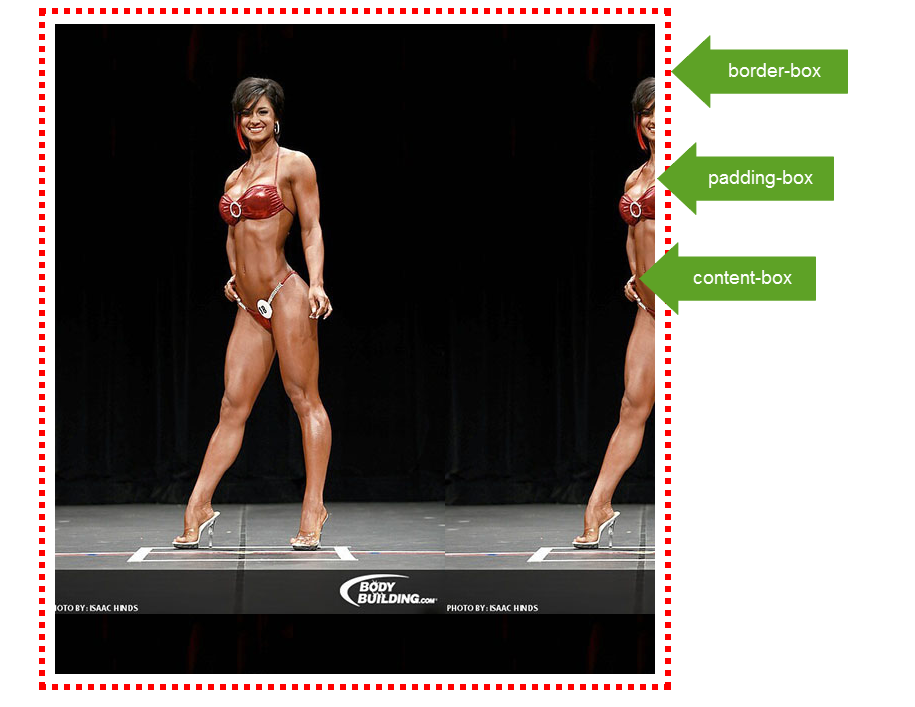
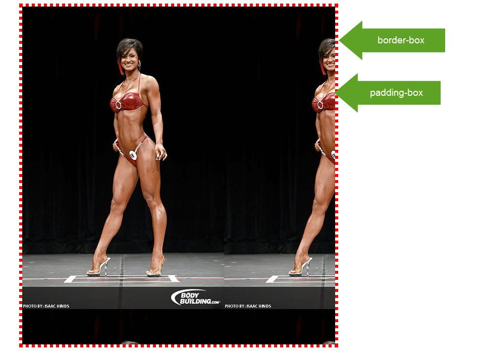
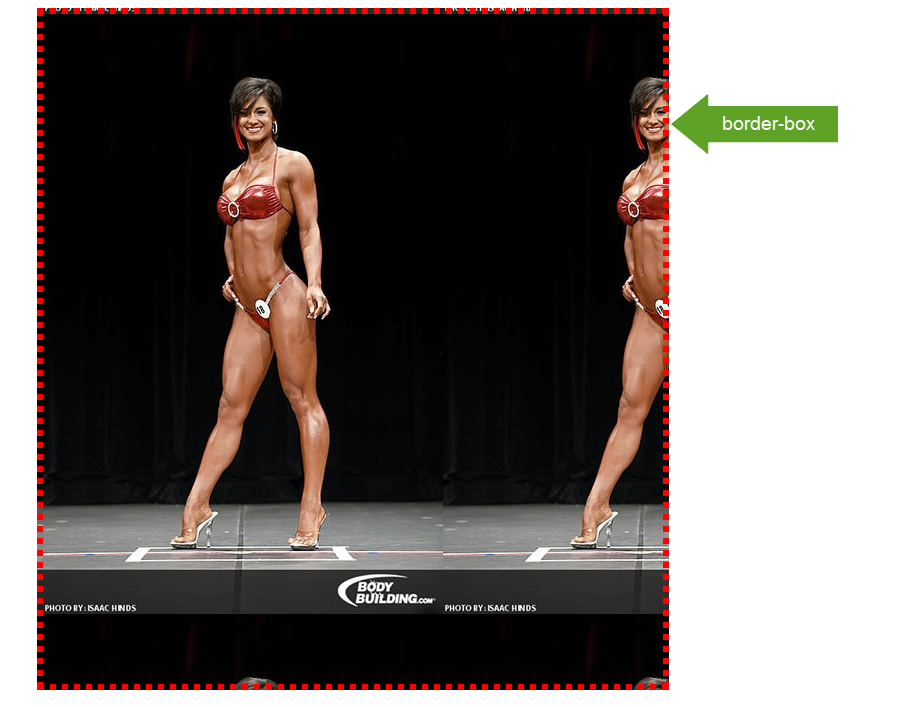
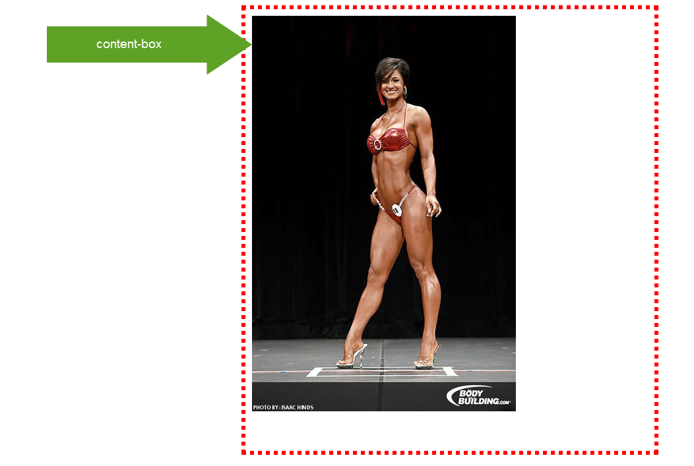
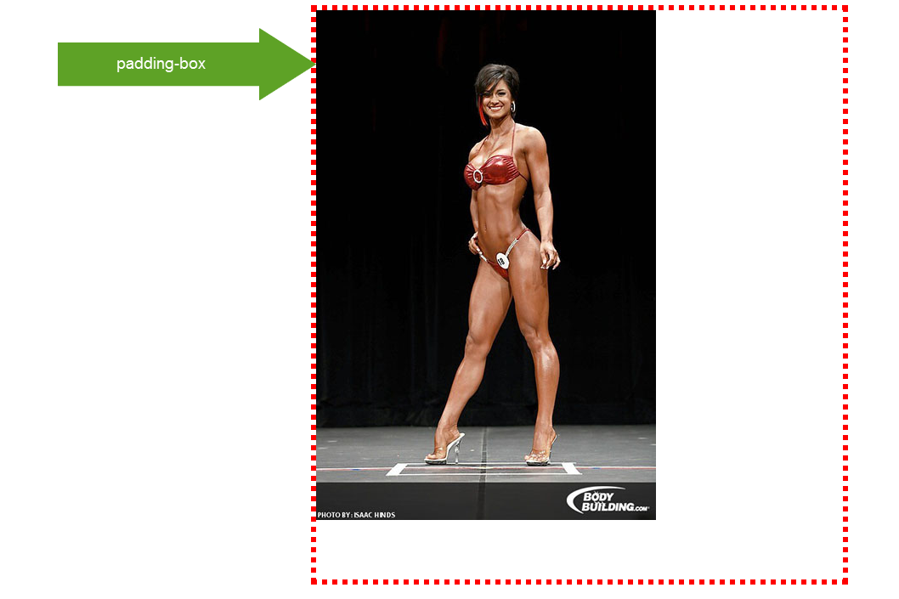
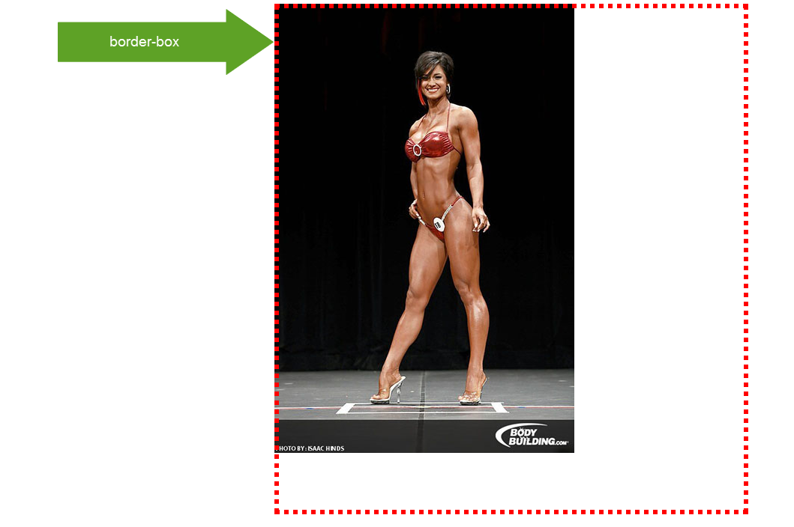
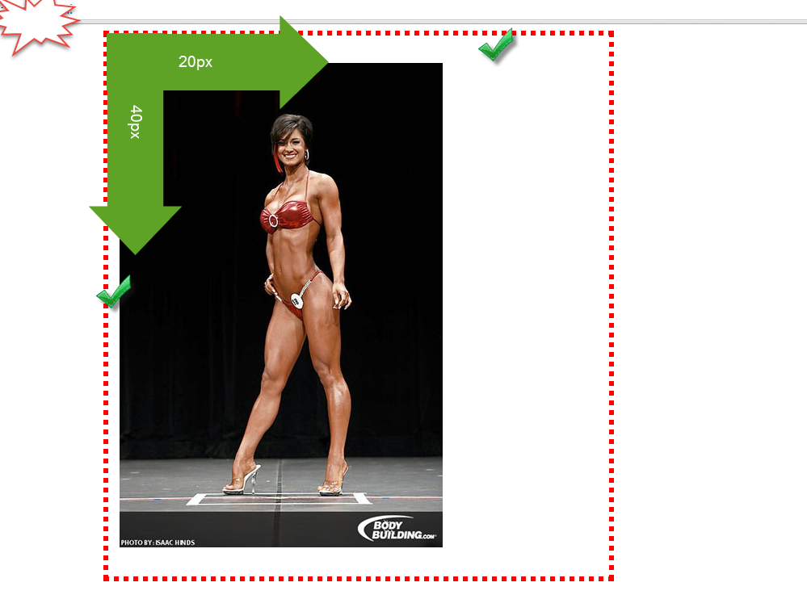
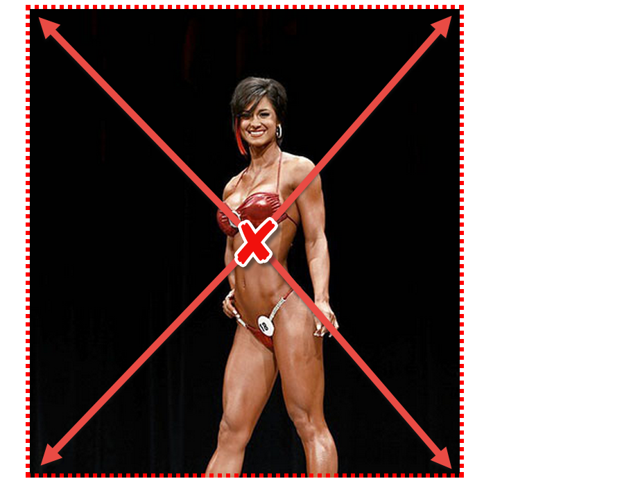
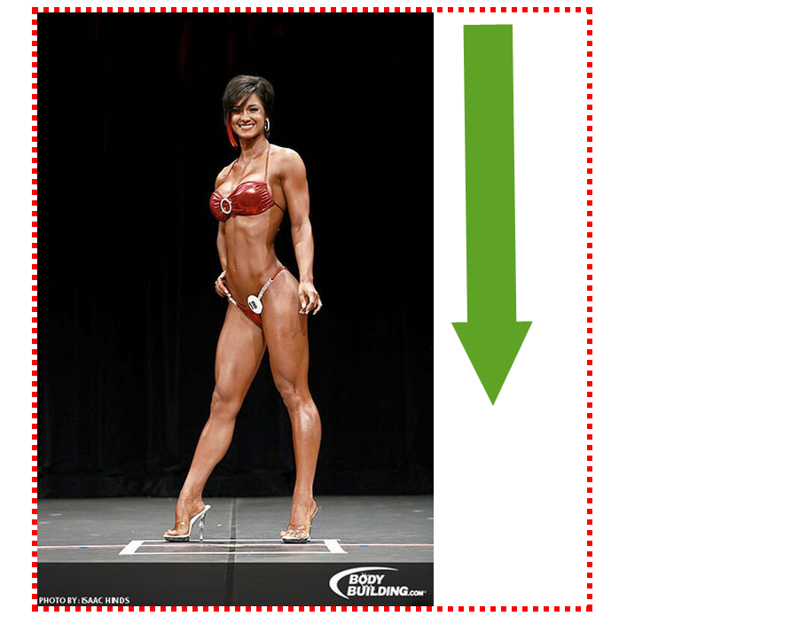

### Background-сlip

Свойство `background-clip` служит для задания **правил обрезки фонового изображения в блоке**. Как известно, блок имеет три "характеристики": область content-box, область padding-box, область border-box.

Соответственно, можно задать правила обрезки фонового изображения по краям этих областей:

- по область content-box - background-clip: content-box
- по область padding-box - background-clip: padding-box
- по область border-box  - background-clip: border-box

Допустим, имеется блок с HTML-разметкой:

<pre>

</pre>

и CSS-разметкой:

<pre>
.bgclip{
  margin: 0 auto;
  width: 600px;
  height: 650px;
  border: 6px dotted #ff0000;
  padding: 10px;
  background-image: url(../img/vujnich.jpg);
  background-repeat: repeat;
}
</pre>

Видим, что у блока с классом .bgclip имеется область content с размерами width: 600px и height: 650px, область padding с размерами width: 600px+20px = 620px и height: 650px + 20px = 670px, область border с размерами width: 620px+12px = 632px и height: 670px + 12px = 682px.

Соответственно, обрезка по области content-box будет задаваться правилом:

background-clip: content-box;

Хорошо видно, как фоновая картинка занимает только область содержимого и обрезается краями этой области, не допуская распространения дальше.

Обрезка по области padding-box устанавливается правилом:

background-clip: padding-box;

Обрезка по области border-box устанавливается правилом:

background-clip: border-box;

### Background Origin

Задает начальную точку расположения фонового изображения внутри блочной модели элемента. Точнее, производится позиционирование фонового изображения относительно области content-box, области padding-box или же области border-box. Свойство background-origin можно легко спутать со свойством background-clip, однако это совершенно разные понятия.

Свойство background-clip задает правила обрезки фонового изображения. В то время как свойство background-origin устанавливает правила расположения фонового изображения применительно к блочной модели. Не стоит также его путать со свойством background-position, которое задает начальную точку фона внутри одной из областей: content-box, padding-box или border-box.

Другими словами, если можно выразиться вольным языком, для фонового изображения первым по значимости идет свойство background-origin, которое задает ту область, в которой будет располагаться начальная точка этого фона. А затем свойство background-position устанавливает начальную точку фона в заданной области.

Свойство background-origin имеет три значения (три области блока элемента): content-box, padding-box, border-box. Рассмотрим пример для наглядности. Имеется блок с HTML-разметкой:

<pre>

</pre>

и CSS-правилами:

<pre>
.bgclip{
  margin: 0 auto;
  width: 600px;
  height: 650px;
  border: 6px dotted #ff0000;
  padding: 10px;
  background-image: url(../img/vujnich.jpg);
  background-repeat: no-repeat;
}
</pre>

Задается начальная точка фонового изображения в области content-box:

`background-origin: content-box;`	

Начальная точка в области padding-box с помощью правила (по умолчанию установлено в браузере):

background-origin: padding-box;

Начальная точка в области border-box с помощью правила:

А теперь, чтобы "почувствовать" разницу между background-origin и background-position, сделаем так:

<pre>
.bgclip{
  background-origin: border-box;
  background-position: 20px 40px;
}
</pre>

И посмотрим на результат - все сразу станет понятно!

### Масштабирование фонового изображения

Два способа масштабирования фонового изображения. Различаются по методу масштабирования. Первый заключается в том, что центр изображения совмещается с центром блока элемента. Затем изображение "растягивается" во все стороны пропорционально (не нарушая пропорций изображения), чтобы заполнить область элемента. Заполнение происходит до тех пор, пока ширина элемента не совпадет с шириной изображения, а высота элемента не совпадет с высотой изображения.

background-size: cover;

Второй способ заключается в том, что изображение заполняет фон элемента по высоте или ширине, в зависимости от того, к какой стороне "ближе".

Помимо ключевых слов, свойство background-size может принимать значения в px, процентах или em. C помощью пикселей можно точно задать размер фонового изображения:

background-size: 100px 200px;

C помощью процентов можно задать масштабирование таким образом:

background-size: 100px auto;